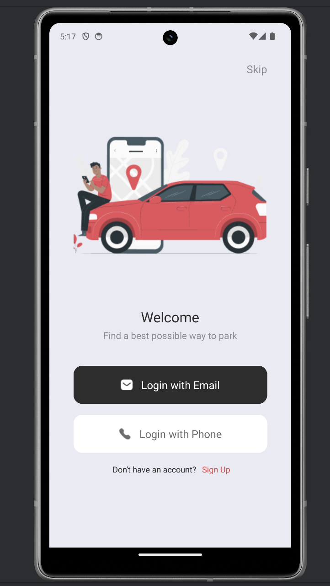

# Hoop App
  
    

  
  ## Table Of Content

  - [Description](#description)
  
  - [Installation](#installation)
  - [Usage](#usage)
  - [Contributing](#contribution)
  - [Tests](#tests)
  - [GitHub](#github)
  - [Contact](#contact)
  - [License](#license)
  

  
  

    

  
  ## Description

    Hoop Parking App
Description: 

The Hoop Parking App is a convenient solution designed to help users find the nearest parking spots for their vehicles within a specific region. Whether you're driving a car, motorcycle, or bicycle, Hoop provides an efficient way to locate available parking spaces, saving you time and reducing the hassle of searching for parking.

Motivation: 

The motivation behind developing the Hoop Parking App stemmed from the increasing challenges faced by drivers when trying to find suitable parking spots, especially in busy urban areas. We recognized the need for a user-friendly and efficient solution to alleviate the stress and frustration associated with parking, thus enhancing the overall driving experience.

Purpose:

The primary objective of the Hoop Parking App is to streamline the parking process for users by offering real-time information on available parking spaces in their vicinity. By leveraging technology, the app aims to simplify the task of parking, enabling users to quickly locate suitable spots for their vehicles without unnecessary delays or complications.

Key Features:

Vehicle-Specific Parking: Users can specify the type of vehicle they are driving (car, motorcycle, bicycle) to find parking spaces tailored to their needs.
Real-Time Updates: The app provides up-to-date information on parking availability, including the number of spots available and their locations.
Navigation Integration: Seamlessly integrates with navigation apps to provide directions to selected parking spots, ensuring a smooth and hassle-free parking experience.
User-Friendly Interface: Designed with simplicity and ease of use in mind, the app offers an intuitive interface that allows users to quickly navigate and access the information they need.
What We Learned
During the development of the Hoop Parking App, we gained valuable insights into the complexities of parking management and the importance of efficient navigation solutions. Additionally, we honed our skills in user interface design, real-time data integration, and optimizing user experiences in mobile applications.

Future Enhancements:

Integration with parking payment systems for seamless payment processing.
Expansion to include additional features such as parking reservations and parking space sharing among users.
Implementation of advanced algorithms for predicting parking availability based on historical data and user patterns.
Contributing
We welcome contributions from the community to further enhance and improve the Hoop Parking App. Whether you're a developer, designer, or parking enthusiast, your feedback and contributions are invaluable in making Hoop the go-to solution for hassle-free parking.

License:

The Hoop Parking App is licensed under the MIT License. See the LICENSE file for more details.

Contact Us:

For inquiries, suggestions, or support, please contact us at ndahiropacific@gmail.com / eudoxieumwali@gmail.com. We'd love to hear from you!

  

  

  
  

  

     
  Hoop-App.png
  

  

  

  ## Installation

  If you are a Developer an you'd like to contribute to the app : 
Clone the Repository:

git clone https://github.com/yourusername/hoop_app.git

Navigate to the Project Directory:
cd hoop_app

Install Dependencies:
npm install

Start the Development Server:

For iOS:
npm run ios

For Android:
npm run android

For Web:
npm run web

Follow the instructions to launch the app on your preferred platform (iOS, Android, or Web).

That's it! You've successfully installed the Hoop Parking App and can now start developing or using it.

If you Want to use our app , download the "Hoop" app from Appstore or Playstore.

  

  
  Hoop App is built with the following tools and libraries: <ul><li>Expo</li> <li>React Native</li> <li>React Navigation</li> <li>Expo Linking</li> <li>Expo Constants</li> <li>Expo Status Bar</li> <li>Expo Router</li> <li>React Native Gesture Handler</li> <li>React Native Safe Area Context</li> <li>React Native Screens</li> <li>React Native Web</li> <li>React Native Image Slider</li> <li>Inquirer</li> <li>Standard Version</li> <li>TypeScript</li> <li>Babel Core</li></ul>
  

  

  ## Usage
 
  To use the Hoop Parking App, follow these steps:

Installation:

Ensure you have Node.js installed on your machine.
Clone the repository from GitHub.
Navigate to the project directory in your terminal.
Run npm install to install dependencies.
Running the App:

To start the app, run npm start or expo start.
Choose your preferred platform (Android, iOS, or web) by pressing the corresponding key.
Follow the instructions provided by Expo to launch the app on your chosen platform.
Using the App:

Upon launching the app, you will be presented with the main screen.
Use the navigation options to explore different features of the app.
Search for parking spots by entering your location or selecting from nearby options.
View details of each parking spot, including availability, pricing, and reviews.
Use additional features such as booking, navigation, and reviews to enhance your parking experience.
Feedback and Support:

If you encounter any issues or have feedback, please report them on the GitHub repository.
For further assistance or inquiries, contact our support team at support@hoopapp.com.
Enjoy Using Hoop!

We hope you find Hoop convenient and efficient for finding parking spots. Enjoy hassle-free parking with Hoop!

  

  

  ## Contribution
 
  Contribution Guidelines:

Thank you for considering contributing to the Hoop Parking App! Contributions from users like you help improve the app for everyone. To contribute, please follow these guidelines:

Fork the Repository:

Fork the repository to your GitHub account.
Clone the Repository:

Clone the forked repository to your local machine using git clone.
Create a Branch:

Create a new branch for your contribution using git checkout -b feature/<feature-name>.
Make Changes:

Implement your desired changes or add new features.
Test Your Changes:

Test your changes locally to ensure they work as expected.
Commit Your Changes:

Commit your changes with descriptive commit messages using git commit -m "Your message".
Push Changes:

Push your changes to your forked repository with git push origin feature/<feature-name>.
Create a Pull Request:

Once you have pushed your changes, create a pull request (PR) from your forked repository to the main repository.
Provide a detailed description of your changes in the PR.
Review and Iterate:

Collaborate with other contributors and address any feedback or comments on your PR.
Make necessary changes based on feedback and push them to the same branch in your forked repository.
Merge Pull Request:

Once your PR has been reviewed and approved, it will be merged into the main repository by the project maintainers.
Thank You:

Thank you for your contribution! Your efforts help make the Hoop Parking App better for everyone.
Happy Contributing!

  

  

  ## Tests
 
  Test Instructions:

To test the Hoop Parking App, follow these instructions:

Installation:

Clone the repository to your local machine.
Navigate to the project directory.
Install dependencies by running npm install.
Run the App:

Run the app using Expo by executing npm start.
Follow the instructions to launch the app on your preferred platform (iOS, Android, or web).
Explore Features:

Once the app is running, explore its various features.
Test functionalities such as finding nearest parking spots, filtering spots by vehicle type, and navigating through the app's interface.
Test Navigation:

Test navigation between different screens and components.
Ensure smooth transitions and proper rendering of UI elements.
Test User Interactions:

Test user interactions such as tapping buttons, entering text into input fields, and interacting with interactive components like maps or sliders.
Verify Data Accuracy:

Verify that the app accurately displays parking spot information, including location details, availability, and pricing.
Check Responsiveness:

Test the app's responsiveness on different devices and screen sizes.
Ensure that the app adapts well to various orientations and resolutions.
Test Error Handling:

Intentionally trigger errors by entering invalid inputs or performing actions that should result in error messages.
Verify that error messages are displayed appropriately and provide helpful guidance to users.
Accessibility Testing:

Test the app's accessibility features by using assistive technologies or enabling accessibility settings on your device.
Ensure that all users, including those with disabilities, can navigate and use the app effectively.
Report Issues:

If you encounter any bugs, issues, or unexpected behavior, report them by creating a GitHub issue in the project's repository.
Provide detailed descriptions, steps to reproduce, and any relevant screenshots or error messages.
Provide Feedback:

Share your feedback, suggestions, or improvements by contributing to discussions in the project's repository or contacting the project maintainers directly.
By following these test instructions, you can thoroughly evaluate the functionality and usability of the Hoop Parking App.

  

  

  ## GitHub

  <a href="https://github.com/Paccyfic , aimeudoxie"><strong>Paccyfic , aimeudoxie</a></strong>
  

  
  
  

  ## Contact

  Feel free to reach out to me on my email:
  ndahiropacific@gmail.com  ,  eudoxieumwali@gmail.com
  

  

  ## License

  
  

  
